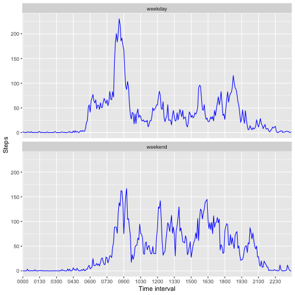

## Loading and preprocessing the data

``` r
library(dplyr)
library(lubridate)
df <- read.table(
    unz("activity.zip", "activity.csv"), 
    sep = ",", 
    header = TRUE, 
    na.strings = "NA") %>%
  # convert date
  mutate(activity_date = ymd(date), 
         # convert interval to have leading zeros
         interval=sprintf("%04d", interval), 
         # add a separate column for <hh:mm> interval representation
         interval_str=paste(substr(interval, 1,2), ':', substr(interval, 3,4), sep = ''))
```

## What is mean total number of steps taken per day?
### Calculate the total number of steps taken per day

``` r
total_per_day <- df %>% 
  group_by(activity_date) %>% 
  summarise(total = sum(steps))
```

### Make a histogram of the total number of steps taken each day

``` r
hist(total_per_day$total, breaks=20, 
     main="Total number of steps by date", xlab="Steps")
```

### Calculate and report the mean and median of the total number of steps taken per day

The mean value **10766.2** is almost the same as the median value **10765**. Thus the lines for <font color="blue">mean</font> and <font color="green">median</font> will overlay on each other at the histogram. 


``` r
abline(v=mean(total_per_day_median$total, na.rm=TRUE), col="blue", lwd=2, lty=3)
abline(v=median(total_per_day_median$total, na.rm=TRUE), col="green", lwd=2, lty=4)
```


## What is the average daily activity pattern?
### Make a time series plot (i.e. <font color="red"> type = "l" </font>) of the 5-minute interval (x-axis) and the average number of steps taken, averaged across all days (y-axis)

``` r
average_per_interval <- df %>% 
  group_by(interval) %>% 
  summarise(average = mean(steps, na.rm = TRUE))

average_per_interval %>% plot(interval ~ average, type="l", 
                              xlab="Time", main="Steps average during the day", xaxt="n")
axis(1, labels=unique(df$interval_str), at=unique(df$interval))
```


### Which 5-minute interval, on average across all the days in the dataset, contains the maximum number of steps?

``` r
average_per_interval %>% slice_max(average)
```

```
## # A tibble: 1 × 2
##   interval average
##   <chr>      <dbl>
## 1 0835        206.
```

## Imputing missing values
### Calculate and report the total number of missing values in the dataset (i.e. the total number of rows with <font color="red">**NAs**</font>)

``` r
missing_rows <- sum(is.na(df$steps))
missing_rows_p <- mean(is.na(df$steps)) * 100
```
The original data set has **2304** rows or **13.1%**. 

### Devise a strategy for filling in all of the missing values in the dataset
We'll impute the missing steps values with the average steps value for the same time interval. The values are already calculated and stored in the `average_per_interval`.

### Create a new dataset that is equal to the original dataset but with the missing data filled in.

``` r
imputed <- df %>% 
  left_join(average_per_interval, by="interval") %>%
  mutate(steps = coalesce(steps, average)) %>%
  select(-average)
```

### Make a histogram of the total number of steps taken each day 

``` r
imputed_total_per_day <- imputed %>% 
  group_by(activity_date) %>% 
  summarise(total = sum(steps))
```

``` r
hist(imputed_total_per_day$total, breaks=20, 
     main="Total number of steps by date (imputed)", xlab="Steps")
```


### Calculate and report the mean and median total number of steps taken per day. Do these values differ from the estimates from the first part of the assignment?

``` r
summary(imputed_total_per_day)
```

```
##  activity_date            total      
##  Min.   :2012-10-01   Min.   :   41  
##  1st Qu.:2012-10-16   1st Qu.: 9819  
##  Median :2012-10-31   Median :10766  
##  Mean   :2012-10-31   Mean   :10766  
##  3rd Qu.:2012-11-15   3rd Qu.:12811  
##  Max.   :2012-11-30   Max.   :21194
```
For the reference see the first estimates mean of **1.0766189 &times; 10<sup>4</sup>** and median of **10765**. 

### What is the impact of imputing missing data on the estimates of the total daily number of steps?
A bit less variance, we smoothed the values


## Are there differences in activity patterns between weekdays and weekends?
### Create a new factor variable in the dataset with two levels – “weekday” and “weekend” indicating whether a given date is a weekday or weekend day.

``` r
# wday(week_start = 1) -> 1 is Monday, ..., 7 is Sunday
imputed <- imputed %>% mutate(week_day = ifelse(wday(date, week_start = 1) > 5, 
                                                "weekend", "weekday"), 
                              week_day = factor(week_day))
```
### Make a panel plot containing a time series plot (i.e. <font color="red"> type = "l"</font>) of the 5-minute interval (x-axis) and the average number of steps taken, averaged across all weekday days or weekend days (y-axis).

``` r
library(ggplot2)
intervals <- unique(df$interval)
sample_intervals <- intervals[seq(1,length(intervals), 18)]
imputed %>% 
  aggregate(steps ~ week_day + interval, FUN=mean) %>%
  ggplot(aes(x=interval, y=steps, group=1)) + 
  geom_line(colour="blue") + 
  facet_wrap(~week_day, ncol=1) + 
  labs(x = "Time interval", y = "Steps") + 
  scale_x_discrete(breaks = sample_intervals)
```


